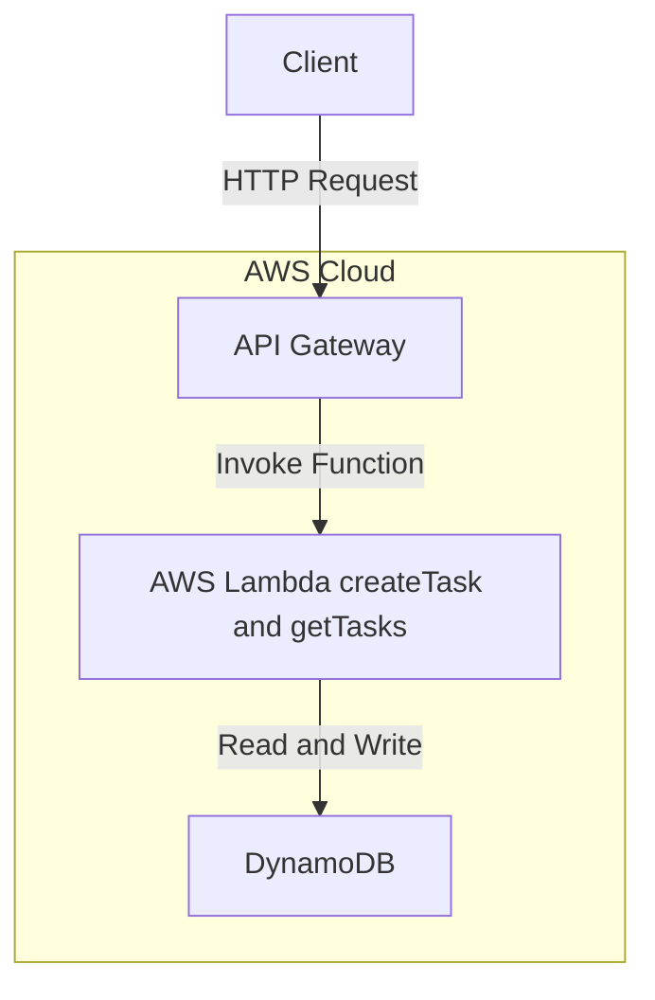

# AWS Task API

A simple serverless backend API built using AWS Lambda, API Gateway, and DynamoDB.

This project demonstrates how to design and deploy a scalable cloud-native application without managing servers.

---

## Features

* Create tasks
* Retrieve tasks by userId
* Serverless architecture (no servers to manage)
* Scalable and cost-efficient design

---
## Live API

GET:
https://0azoel99xd.execute-api.us-east-1.amazonaws.com/tasks?userId=test-user

---

## Architecture



* AWS Lambda -> Handles business logic (createTask, getTasks)
* API Gateway -> Exposes HTTP endpoints
* DynamoDB -> Stores task data

---

## API Endpoints

### GET /tasks?userId=test-user

Retrieve all tasks for a specific user

Example request:  
GET /tasks?userId=test-user

Example response:

```json
{
  "tasks": [
    {
      "taskId": "123",
      "title": "My first task",
      "completed": false,
      "createdAt": "2026-03-18T01:16:24.724434",
      "userId": "test-user"
    }
  ]
}
```

---

### POST /tasks

Create a new task

Example request body:

```json
{
  "userId": "test-user",
  "title": "New Task"
}
```

Example response:

```json
{
  "message": "Task created successfully"
}
```

---

## Testing

You can test the API using:

* Browser (for GET requests)
* Postman (recommended for POST requests)
* Curl (via terminal)

Example:

```bash
curl "https://0azoel99xd.execute-api.us-east-1.amazonaws.com/tasks?userId=test-user"

curl -X POST "https://0azoel99xd.execute-api.us-east-1.amazonaws.com/tasks" \
  -H "Content-Type: application/json" \
  -d '{"userId":"test-user","title":"New Task"}'
```

---

## Tech Stack

* Node.js (AWS Lambda runtime)
* AWS Lambda
* Amazon API Gateway
* Amazon DynamoDB

---

## Project Structure

```text
aws-task-api/
├── createTask/
│   └── index.js
├── getTasks/
│   └── index.js
├── README.md
```

---


## Future Improvements

* Add authentication (JWT / Cognito)
* Input validation
* Error handling improvements
* Frontend integration (React or simple UI)
* Infrastructure as Code (Terraform or CloudFormation)

---

## Author

Julio Pardo  
Cloud Computing Student | AWS Certified
